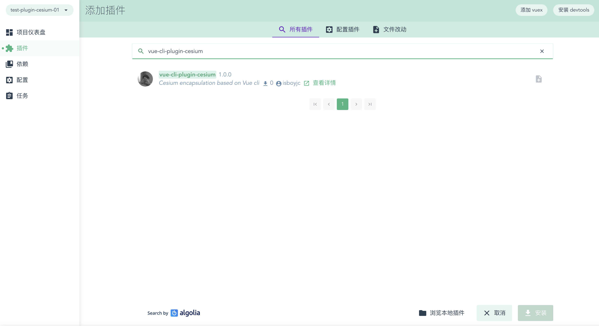
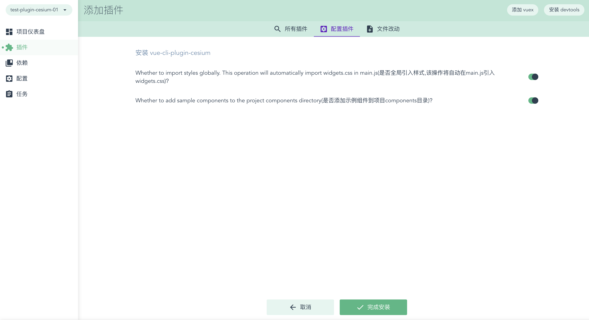

# vue-cli-plugin-cesium
基于Vue-cli的cesium封装(Cesium encapsulation based on Vue cli)


### 前言

通常情况下，我们要在vue中使用Cesium，首先要安装Cesium，然后要在vue-cli的webpack配置很多东西，对一些有经验的人来说只不过麻烦些，但是对Cesium的初学者来说会很痛苦，因为没有使用过，也不知到要怎么配置，只能搜索网上的教程，一步一步踩坑

作为前端，我在学习Cesium，踩坑无数，当然也经历过这些

其实不管是有经验或是初学者，每次写项目重复配置这些东西都很麻烦

vue-cli-plugin-cesium就是为了解决这个问题


### 介绍

vue-cli-plugin-cesium是一个针对Cesium的vue-cli扩展插件，使用它将会让我们在vue-cli中零配置使用Cesium

它会在我们已经创建好的vue-cli中做基于Cesium的扩展，如下

- 自动安装cesium并追加至`package.json`依赖项

- 自动扩展vue-cli中cesium相关的webpack配置
  - 添加一个`cesium`别名，以便我们在项目中轻松的引入它
  - 使Cesium对象实例可在每个Vue模块中使用而无须import引入
  - 使webpack可正常打包Cesium
  - 允许webpack友好地在Cesium中使用require，解决require引入警告
  - 开发环境生成sourcemap，生产环境取消sourcemap
  - 生产环境抽取公共模块执行压缩
  - 生产环境loader切换到优化模式
- 自动在全局main.js中引入`Widgets.css`，可选
- 自动在`components/`文件夹下生成示例文件，可选


### 使用

vue-cli-plugin-cesium是基于vue-cli的扩展插件，所以在使用前要先安装vue-cli，并使用vue-cli创建一个vue项目

如果您不了解vue-cli的使用，请移步官网 [vue-cli-官网](https://cli.vuejs.org/zh/guide/) 

当前插件只支持`vue-cli3.0+`版本哦

创建好一个vue项目后就可以按照以下步骤使用该插件了

##### 安装

首先是安装vue-cli-plugin-cesium插件，推荐使用yarn安装，因为它更简洁

```js
// npm
npm install --save-dev vue-cli-plugin-cesium

// yarn
yarn add vue-cli-plugin-cesium
```


##### 调用

安装完成后我们要使用 `vue invoke` 来初始化这个插件

```js
vue invoke vue-cli-plugin-cesium
```

在初始化的过程中会有两个询问

```js
Whether to import styles globally. This operation will automatically import widgets.css in main.js?
是否全局引入样式,该操作将自动在main.js引入widgets.css？
```

此项默认为yes，该操作将自动在main.js引入widgets.css，即全局引入cesium的css样式

如果此项设置为no，那么将来开发时我们要手动引入`widgets.css`样式文件，引入命令如下

```js
import 'cesium/Widgets/widgets.css';
```


```js
Whether to add sample components to the project components directory?
是否添加示例组件到项目components目录?
```

此选项默认为yes，该操作会自动在`src/components`文件夹下生成`CesiumExample`文件夹，此文件夹中包含一些Cesium的使用示例供参考

如果此项设置为no，则不生成示例文件


### GUI中使用

如果我们使用`vue ui`创建项目，也可以直接在项目创建后的插件选项里搜索vue-cli-plugin-cesium并安装

如下所示：






如果对您有所帮助，那么这将是我的荣幸

后期我会慢慢的完善此插件，并不停迭代，也欢迎大家提出建议

如果您觉得还行，点个star再走哟

